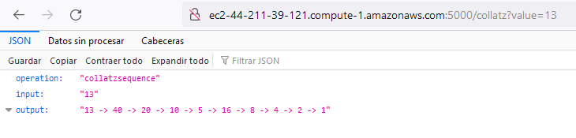
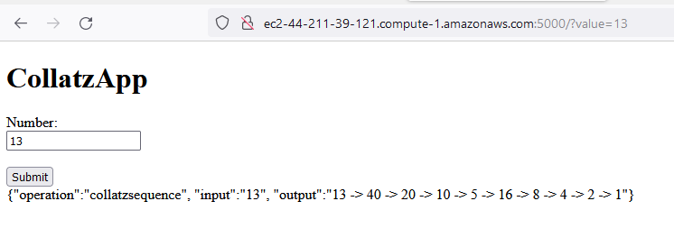

# Titulo

Parcial AREP 2

## Estudiante

Juan Carlos Baez Lizarazo

### Descripción

En este repositorio, se verá un servicio web desplegado en docker para facilitar la subida a aws.

Este servicio web es una implementacion de la conjetura Collatz

### Pruebas
#### Json Bakend

#### Front App

#### Video demostración
[Video](./media/video.mp4)

### Guia de uso

Para correr local este proyecto, debe clonar el repositorio
```
git clone https://github.com/juanbaezl/parcialArep2
```

una vez clonado, debe compilar el proyecto con 

```
mvn git
```

y para correrlo debe usar el siguiente comando

```
java -cp "target/classes:target/dependency/*" co.edu.escuelaing.App
```

En caso de correrlo en windows debe cambiar el ":" a ";"

### Explicación AWS

Para hacer su propio aws con esta aplicación web, primero debe lanzar una instancia EC2, luego en el grupo de seguridad de esa instancia, abrir el puerto que va a utilizar (para esta explicación se usará el puerto 5000), una vez hecho esto se debe conectar a la máquina por ssh y allí debe ejecutar los siguientes comandos:

```
sudo yum update -y
sudo yum install docker
```

Los anteriores son para instalar docker

```
sudo service docker start
sudo usermod -a -G docker ec2-user
```

Estos son para iniciar el servicio y configurarlo con su usuario para no tener que usar "sudo"

```
docker run -d -p 5000:5000 --name dockerparcial juanbaezl/parcialarep2
```
Este correra el contenedor que se encuentra en el sguiente repositorio de docker https://hub.docker.com/repository/docker/juanbaezl/parcialarep2 en el puerto 5000

Una vez haga esto, podrá visualizar su página web, con su respectiva url

**Nota: Debe poner el puerto en el buscador como se ve en los pantallazos**